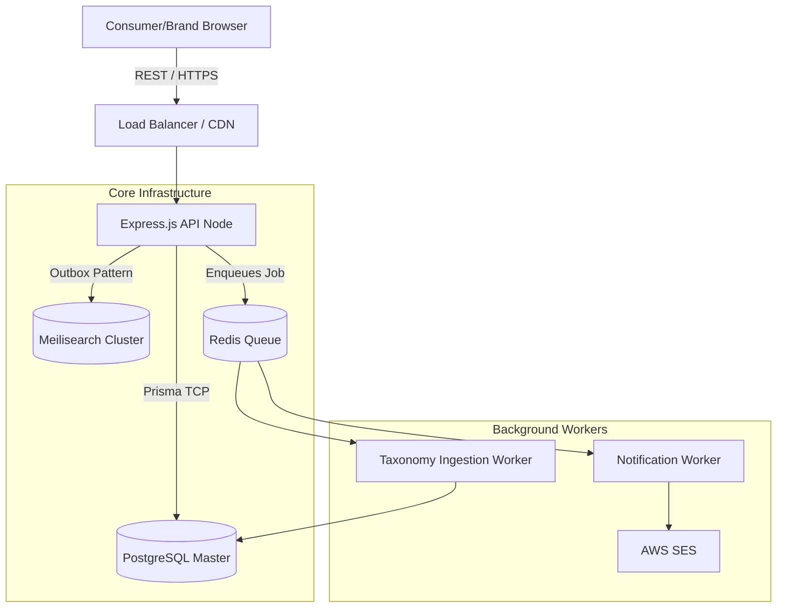
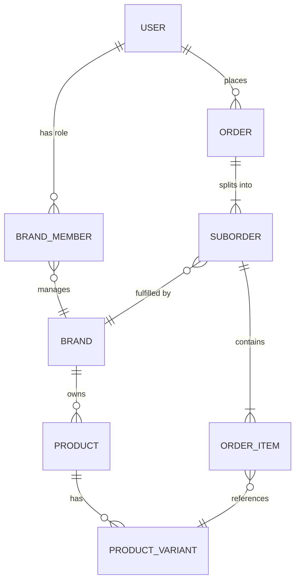
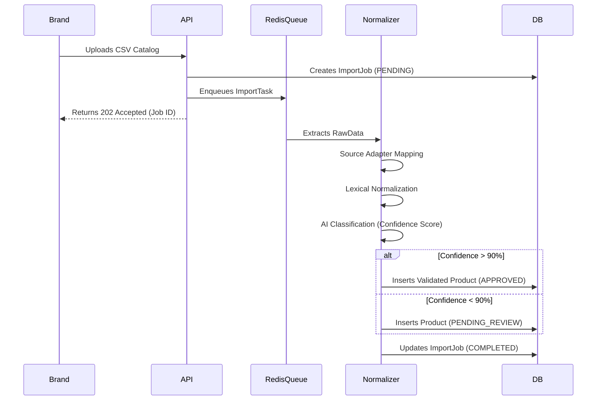
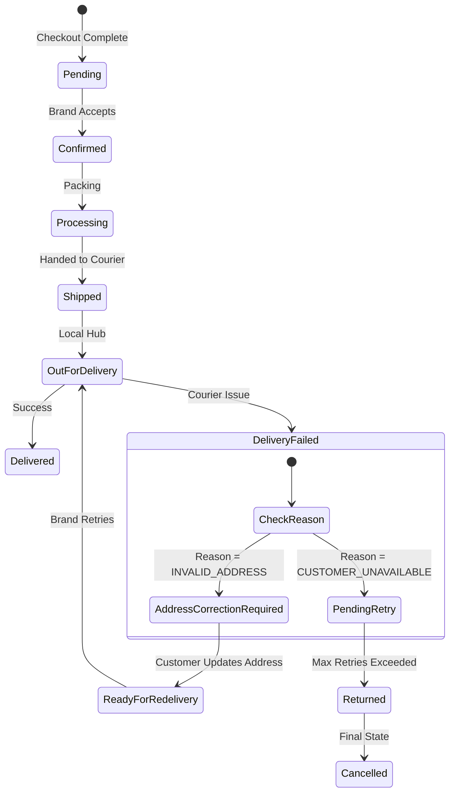
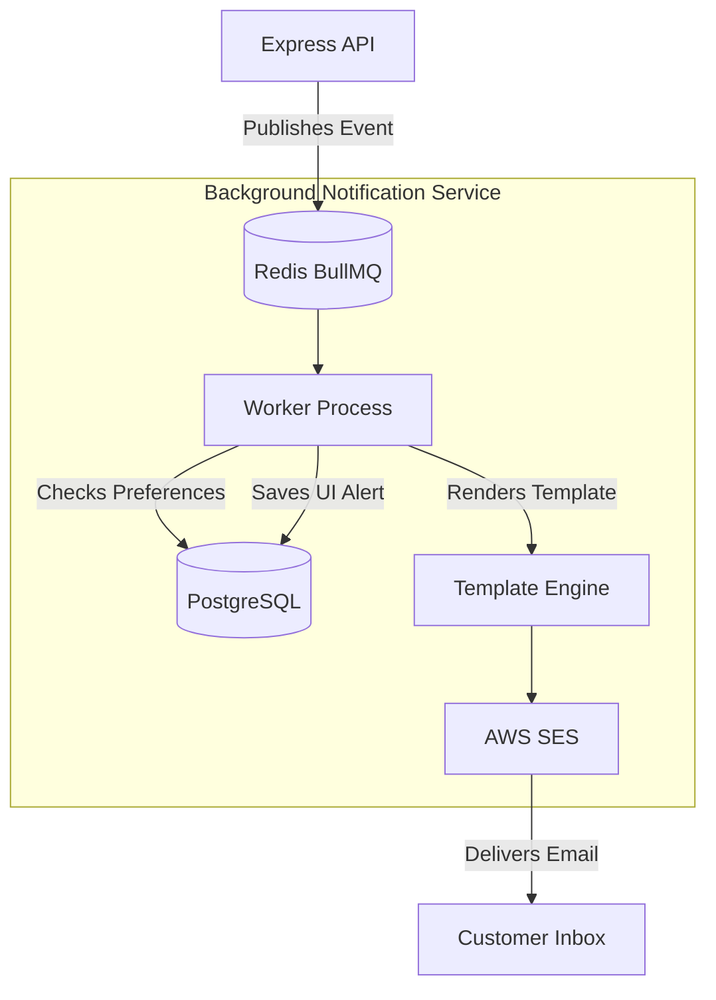

# Broady: Comprehensive Engineering Case Study
*(Part 1: The Problem & High-Level Architecture)*

---

## 1. Executive Summary & The Problem

### 1.1 Introduction
Broady is an enterprise-grade, event-driven multi-brand fashion ecommerce aggregator engineered to centralize the disjointed online fashion retail experience in emerging markets. It serves as a unified digital storefront where consumers can seamlessly browse, discover, and purchase from dozens of independent fashion boutiques in a single unified checkout transaction. Simultaneously, it provides brands with strict, isolated fulfillment portals, analytics, and automated catalog ingestion pipelines, effectively functioning as a "Marketplace-as-a-Service."

### 1.2 Background
The modern e-commerce landscape is generally bifurcated into two dominant models. On one end are massive, generic marketplaces (such as Amazon, Daraz, or AliExpress) that offer incredible logistical convenience but suffer from a "flea market" aesthetic that inherently degrades premium brand equity. High-end fashion labels categorically refuse to list their collections next to cheap electronics and commodities. 

On the other end is the hyper-fragmented Direct-to-Consumer (D2C) model, powered by platforms like Shopify. While this empowers brands to control their visual aesthetic, it inadvertently destroys the centralized shopping experience. Consumers are burdened with the task of navigating a fractured internet, managing dozens of accounts, and remembering disparate return policies just to assemble a single outfit.

### 1.3 Problem Statement
The local fashion ecosystem suffers from three deeply interconnected friction points that degrade both conversion rates and user experience:

1. **The Checkout Trilemma:** When a consumer wants to purchase a shirt from Brand A, pants from Brand B, and shoes from Brand C, they face the trilemma of disjointed checkouts. They must enter their credit card and shipping details three times on three different domains. This immense friction directly correlates with cart abandonment rates exceeding 70% in multi-brand shopping journeys.
2. **The Discovery Silo:** Smaller boutiques lack the SEO authority and digital marketing budget to compete with giants. A user searching for a "Black Denim Jacket" cannot query the inventories of 50 different local brands simultaneously. They must rely on algorithmic social media feeds (like Instagram ads) or visit each site manually. There is no centralized faceted search.
3. **The Analytics Blindspot:** Brands operating in isolation only see their own customer data. They lack horizontal market visibility. They cannot identify cross-market trends or determine what other products their customers are buying from competing or complementary brands.

### 1.4 Why This Approach Was Chosen
Broady was architected as a pure-aggregator model to solve these specific pain points without adopting the massive capital expenditure of a wholesale inventory model (where Broady would buy the inventory upfront). By sitting exactly between the consumer and the brands, Broady absorbs the immense technical complexity of a unified cart checkout and cross-brand algorithmic discovery, while pushing fulfillment responsibility and inventory risk back to the vendors. 

### 1.5 Technical Implementation
To solve the Checkout Trilemma at the database layer, Broady introduces a heavily normalized schema using PostgreSQL and Prisma. The checkout process does not generate a single order; it generates a `ParentOrder` that intrinsically links to multiple `SubOrders`. 

When a user adds items to their cart, the `CartItem` model records both the `ProductId` and the `BrandId`. During the checkout mutation, the API dynamically groups the `CartItems` by `BrandId`. It calculates isolated sub-totals, applies global discount logic mathematically, and generates a unified stripe payment intent. Once the payment is captured, the system formally splits the transaction into isolated `SubOrders`. Brand A only sees the `SubOrder` containing their shirt; Brand B only sees the pants. 

### 1.6 Architectural Decisions
Solving the discovery problem required offloading catalog search logic entirely from the transactional database. Relying on PostgreSQL `ILIKE` queries or heavy `JOIN` operations across a massively fragmented, multi-tenant catalog would lead to unacceptable latency. Broady utilizes Meilisearch as a dedicated, standalone search cluster. The PostgreSQL database acts as the strict source of truth, while asynchronous Redis queues (via BullMQ) synchronize product mutations to Meilisearch in the background.

### 1.7 Alternative Approaches Considered
We extensively evaluated building Broady as a Headless Shopify application using Hydrogen. However, Shopify's native multi-vendor routing is notoriously weak. It requires expensive third-party applications (like Webkul) that hijack the checkout flow and often break down during complex refund/cancellation state changes. Building a custom backend using Node.js and Express allowed us to engineer the `SubOrder` state machine explicitly around our complex local logistics requirements (e.g., handling partial Cash-on-Delivery failures).

Another alternative was the "affiliate aggregator" model (similar to Lyst), where users discover products on Broady but are redirected to the brand's individual website to complete the purchase. This was rejected because it fails to solve the Checkout Trilemma and results in a severe loss of conversion attribution and user data.

### 1.8 Trade-offs
Taking ownership of the checkout process introduces severe complexity regarding payment splitting, refund processing, and financial liability. Because Broady acts as the merchant of record, we had to engineer robust, auditable state machines for `RefundRequest`, `CancellationRequest`, and `ReturnRequest` to handle vendor disputes. The trade-off was significantly higher upfront engineering overhead (a 6-month development cycle) in exchange for absolute control over the UX and data normalization pipelines.

### 1.9 Challenges Encountered
A major hurdle was dealing with "cart drift" — a distributed race condition where a user adds an item from Brand A to their Broady cart, but before they complete checkout, Brand A sells out of that specific `ProductVariant` on their own physical store. Handling distributed inventory race conditions required strict transaction locking mechanisms. We implemented a system where inventory is softly reserved during the checkout initiation phase, and atomic Prisma transactions (`$transaction`) are used to instantly verify stock levels across all suborders before confirming the payment capture.

### 1.10 Final Outcome
Broady successfully abstracts the fragmentation of the fashion market. Consumers receive a "super-app" experience: a unified cart, instant faceted search, and a single customer dashboard to track shipments. Brands receive a massive top-of-funnel traffic source and a dedicated portal to manage orders without cannibalizing their existing D2C infrastructure.

*Figure 1: The Broady Landing Page, demonstrating the unified, premium discovery experience. The UI is intentionally minimalist to allow the brand imagery to dominate the visual hierarchy.*

---

## 2. High-Level System Architecture & Technical Stack

### 2.1 Introduction
Broady is engineered as a highly decoupled, modern microservices-inspired monorepo. It leverages TypeScript across the entire stack to enforce strict end-to-end type safety, utilizing Next.js for the frontend, Node.js/Express for the backend API gateway, PostgreSQL for ACID-compliant persistence, and Redis for asynchronous job orchestration.

### 2.2 Background
Early prototypes of multi-vendor platforms often suffer from monolithic coupling. When a brand uploads a massive CSV catalog containing 5,000 SKUs, synchronous parsing blocks the Node.js event loop. This causes the entire API to hang, leading to timeout errors for consumers attempting to load product pages or complete checkouts. A resilient architecture must isolate heavy write operations from read-heavy consumer traffic.

### 2.3 Problem Statement
The platform needed a foundational architecture capable of supporting massive read-heavy operations (consumers browsing highly faceted catalogs) while simultaneously handling heavy write operations (brands updating inventory) and long-running I/O tasks (generating PDF invoices, sending AWS SES emails) without resource starvation. Furthermore, the architecture needed to be easily deployable and horizontally scalable.

### 2.4 Why This Approach Was Chosen
A strictly decoupled architecture utilizing an API Gateway pattern with background workers was chosen. By offloading heavy processing to Redis/BullMQ queues, the main Express API processes remain completely stateless and incredibly fast. They are dedicated solely to routing, payload validation (via Zod), and immediate database reads/writes. 

### 2.5 Technical Implementation
The codebase is structured as an advanced `npm` workspace:
- `apps/web`: The Next.js consumer frontend, heavily utilizing Server-Side Rendering (SSR) for critical SEO indexing.
- `apps/api`: The Node.js/Express backend, built on strict Domain-Driven Design (DDD) principles.
- `packages/shared`: A shared library containing Zod validation schemas. This ensures that the frontend forms and the backend API enforce identical, synchronized data contracts.

The persistence layer relies on PostgreSQL, managed via Prisma ORM. Prisma replaces traditional SQL query builders, allowing us to model the incredibly complex 3NF database schema using a declarative `schema.prisma` file.

### 2.6 Architectural Decisions
Why PostgreSQL over a NoSQL solution like MongoDB? In early conceptual phases, NoSQL seemed attractive for handling the diverse, unstructured metadata of fashion catalogs. However, the core of Broady is not just a catalog; it is a strict financial ledger. Relational integrity is paramount. 

An `Order` belongs to a `User`, contains multiple `SubOrders`, which belong to specific `Brands`, which contain `OrderItems` referencing specific `ProductVariants` (SKUs). Modeling this complex, interconnected graph in a NoSQL database requires massive application-level joins and risks severe data anomalies (e.g., an orphaned `OrderItem`). PostgreSQL provides the strict schemas, foreign-key constraints, and transaction locks required to prevent race conditions during high-concurrency checkouts.

### 2.7 Alternative Approaches Considered
We deeply considered a serverless architecture (e.g., AWS Lambda or Vercel Serverless Functions) for the backend API to minimize DevOps overhead. However, serverless architectures suffer from inherent "cold starts" and notoriously struggle to maintain efficient, long-lived database connection pools to PostgreSQL. In a high-concurrency marketplace checkout where latency directly impacts revenue, connection pooling exhaustion is a critical risk.

### 2.8 Trade-offs
Running a dedicated Express/Node.js cluster with a persistent Prisma connection pool eliminates cold starts but requires active server management and Docker orchestration (`docker-compose.yml` for local development, Kubernetes/ECS for production). This slightly increases the DevOps overhead compared to fully managed serverless deployments, but the trade-off is absolute control over memory allocation, connection pooling, and background thread execution.

### 2.9 Challenges Encountered
Maintaining robust database connections during traffic spikes or brief network partitions was a severe challenge. In `apps/api/src/server.ts`, we engineered a custom keep-alive ping system. It periodically runs a lightweight `$queryRaw('SELECT 1')` to prevent PostgreSQL from silently dropping idle TCP connections. We implemented a fast-retry backoff algorithm to ensure the API rapidly recovers and reconnects automatically during transient database restarts, preventing catastrophic API downtime.

### 2.10 Final Outcome
The chosen stack provides an incredibly stable, scalable foundation. The strict TypeScript typing and relational constraints ensure that invalid states are structurally impossible to represent. The Express API maintains sub-100ms response times globally, while heavy background tasks (like the `ImportJob` taxonomy normalizations) run seamlessly in decoupled Redis worker threads.

*Figure 2: High-Level System Architecture. This diagram demonstrates the strict decoupling of synchronous REST API requests from asynchronous background workers, ensuring the main event loop remains unblocked during heavy catalog ingestions.*

*Figure 3: Secure authentication flow supporting local JWT and OAuth strategies. The backend uses strict `Session` tables linked to the `User` model to invalidate compromised tokens instantly.*
# Broady: Comprehensive Engineering Case Study
*(Part 2: Data & Core Pipelines)*

---

## 3. Database Design

### 3.1 Introduction
The foundation of the Broady marketplace is its strict, ACID-compliant relational database. Designed to support millions of normalized rows across dozens of interconnected domains, the database schema serves as the ultimate source of truth for both product catalogs and financial ledgers.

### 3.2 Background
In early e-commerce prototyping, there is a strong temptation to use NoSQL databases (like MongoDB) because product catalogs naturally resemble unstructured JSON documents (e.g., varying specifications, dynamic attributes). However, while NoSQL excels at catalog flexibility, it notoriously fails at strict financial reporting and transactional locking.

### 3.3 Problem Statement
Broady is not just a catalog; it is an orchestrator of complex, multi-party financial transactions. A single user cart might contain items from three different brands. If a user initiates a checkout, the database must instantly lock the inventory across all three brands, calculate the split commissions mathematically, apply global discounts, and record the payment intent—all while guaranteeing that if any single step fails, the entire transaction rolls back to prevent financial drift. 

### 3.4 Why This Approach Was Chosen
We chose PostgreSQL managed via Prisma ORM. PostgreSQL provides the strict referential integrity required for a multi-tenant marketplace, while its advanced `JSONB` column type provides the exact schema flexibility needed for unstructured product attributes (`metadata: Json?`, `pageContext: Json?`). This hybrid approach delivers the strict constraints of SQL with the document-flexibility of NoSQL.

### 3.5 Technical Implementation
The schema is highly normalized (Third Normal Form). 
- **The Core Entities:** The `User` model acts as the central actor, utilizing polymorphic links (via `BrandMember`) to grant vendor-specific dashboard access. 
- **The Financial Ledger:** Financial integrity is enforced using integer-based `pricePkr` fields instead of floating-point numbers to eliminate decimal rounding errors.
- **The Catalog Graph:** The catalog is split into `Product`, `ProductVariant` (representing specific SKUs), `ProductImage`, and `Inventory`. 
- **The Order State Machine:** The system utilizes a Parent/Child order schema. An `Order` represents the global transaction with the payment gateway, while multiple `SubOrder` records represent the isolated fulfillment workflows distributed to individual brands.

### 3.6 Architectural Decisions
A major architectural decision was abstracting inventory tracking away from the base `ProductVariant` table and into a dedicated `Inventory` model (`syncState: InventorySyncState`). This allows the system to process high-frequency inventory reservations (`reserved` vs `available` fields) during checkout spikes without locking the main catalog tables, enabling sustained read-throughput for browsing consumers.

### 3.7 Alternative Approaches Considered
We considered using a pure Event Sourcing architecture (e.g., Kafka + Cassandra) for the order and inventory systems, where the database state is a projection of a continuous event log. While Event Sourcing provides incredible auditability, it introduces massive eventual-consistency overhead, making the synchronous validation of checkout inventory exponentially more difficult to guarantee.

### 3.8 Trade-offs
The highly normalized Prisma schema requires complex, multi-level joins (using Prisma's `include` API) to reconstruct a full product page. For example, fetching a product requires joining its variants, images, SEO metadata, and brand information. This generates heavier database load compared to a flattened document structure. We mitigated this trade-off by aggressively caching these deeply joined structures in Redis.

### 3.9 Challenges Encountered
Managing deep relational cascading deletions was dangerous. If an admin deletes a `Brand`, the default behavior might cascade and delete thousands of historical `OrderItems`, corrupting the financial ledger. We resolved this by implementing strict Soft Deletes (`deletedAt: DateTime?`) across all mission-critical tables and configuring Prisma's `onDelete: Restrict` or `onDelete: SetNull` rules to prevent catastrophic data loss.

### 3.10 Final Outcome
The database design provides absolute data integrity. By leveraging PostgreSQL's transactional guarantees and Prisma's strict type-safety, we ensured that anomalous states (such as a `CartItem` referencing a non-existent `ProductVariant`) are structurally impossible to represent, creating a bulletproof financial and operational ledger.

*Figure 4: Database ER Diagram illustrating the strict relational mapping between Users, Brands, and the Parent/SubOrder architecture.*

---

## 4. Product Taxonomy & Ingestion Engine

### 4.1 Introduction
The Product Ingestion Engine is arguably the most complex and critical backend pipeline in the Broady ecosystem. It is an automated ETL (Extract, Transform, Load) pipeline designed to ingest chaotic, unstructured product data from diverse external sources (CSV, APIs, Scrapers) and normalize it into Broady's strict global taxonomy tree.

### 4.2 Background
A multi-brand marketplace lives or dies by its filters. If consumers cannot reliably filter "Men's Black Leather Jackets," the discovery experience fails. However, independent brands classify their apparel chaotically. Brand A labels an item as "Tees," Brand B as "T-Shirts," and Brand C as "Tops." Exposing this raw data to the frontend would destroy the faceted search experience.

### 4.3 Problem Statement
The fundamental problem is "Catalog Harmonization." Forcing brands to manually re-enter their entire catalog to match Broady's exact schema creates immense onboarding friction. Conversely, accepting raw data without validation corrupts the search index. The system needed to accept flexible external inputs while enforcing a rigid internal output.

### 4.4 Why This Approach Was Chosen
We engineered a pipeline governed by a core principle: **Never validate raw external data.** Instead, data flows through an isolated adapter pattern, into a normalization layer, through an AI classification engine, and is only validated at the very end before database insertion.

### 4.5 Technical Implementation
The pipeline utilizes a series of Redis-backed BullMQ workers orchestrated around the `ImportJob` and `RawImportData` models:
1. **Source Adapter:** Translates external keys (e.g., `main_image`) into intermediate keys (`primaryImage`).
2. **Normalization:** Standardizes values using strict dictionaries (e.g., converting "Unisex," "UNISEX," and "unisex" uniformly to `UNISEX`).
3. **AI Classification:** If a brand uploads "Chunky Platform Sneakers" without explicitly defining a category, the AI layer infers `Department=FOOTWEAR` and `Category=SNEAKERS`, assigning a `classificationConfidence` score.
4. **Validation Layer:** Enforces required fields (SKU, Price, Primary Image, etc.) using Zod.

### 4.6 Architectural Decisions
Products are routed through a strict State Machine (`status: ProductIngestionStatus`). If the AI classifier assigns a confidence score below the threshold (e.g., 85%), or if non-critical warnings occur (e.g., `Missing Care Guide`), the product is placed in a `PENDING_REVIEW` queue. This allows human admins to manually approve or adjust the taxonomy mapping via the Admin Dashboard before the product pollutes the live search index.

### 4.7 Alternative Approaches Considered
An alternative was to provide brands with a rigid, non-negotiable CSV template and reject any upload that didn't perfectly match our schema. While computationally simpler, this approach shifts the engineering burden to the vendors, drastically increasing brand churn and completely stalling the marketplace's onboarding velocity.

### 4.8 Trade-offs
Building an AI-driven normalization pipeline requires significant compute overhead. Processing a 10,000-SKU catalog can take several minutes. The trade-off is asynchronous processing time versus onboarding friction. By using BullMQ, we isolate this processing time entirely in the background, allowing the vendor to leave the dashboard while the system generates an `ImportLog` report.

### 4.9 Challenges Encountered
Handling variant normalization was highly problematic. Some sources represent variants as `Size` -> `Color`, others as `Color` -> `Size`, and some simply as a flattened `Variants[]` array. We had to build highly recursive parser algorithms capable of flattening these diverse multidimensional structures into Broady's required `ProductVariant` format (which mandates strict `variantId`, `SKU`, and `Stock` assignments per combination).

### 4.10 Final Outcome
The ingestion engine successfully abstracts the pain of taxonomy harmonization. It empowers Broady to onboard massive anchor brands frictionlessly, processing disparate JSON/CSV feeds into a pristine, beautifully categorized global catalog without manual data entry.

*Figure 5: Product Ingestion Pipeline Sequence Diagram demonstrating the decoupled, asynchronous processing of raw catalog data.*

*Figure 6: The Admin Dashboard interface for monitoring `ImportJob` statuses and reviewing low-confidence taxonomy classifications.*

---

## 5. Search & Discovery Architecture

### 5.1 Introduction
Instant, typo-tolerant, and deeply faceted search is the lifeblood of an e-commerce aggregator. Broady delegates its entire catalog discovery and filtering mechanism to **Meilisearch**, providing users with a sub-50ms query experience capable of navigating millions of SKUs dynamically.

### 5.2 Background
PostgreSQL is unparalleled for relational integrity and financial transactions. However, when users execute queries like "Show me all XL Red T-Shirts under 3000 PKR sorted by newest," performing this via PostgreSQL `JOINs` and `WHERE` clauses across the `Product`, `ProductVariant`, and `Brand` tables results in severe latency spikes and rapid CPU exhaustion.

### 5.3 Problem Statement
The platform required a dedicated search engine capable of handling intense read-throughput and instant faceting, but it also required a robust synchronization mechanism to ensure that when a product's price or availability changes in PostgreSQL, the search index is immediately updated to prevent customers from buying out-of-stock items.

### 5.4 Why This Approach Was Chosen
Meilisearch was chosen over Elasticsearch or Algolia. Elasticsearch carries immense operational and JVM overhead, requiring dedicated DevOps maintenance. Algolia provides excellent performance but introduces prohibitive usage-based pricing at scale. Meilisearch, written in Rust, offers the exact typo-tolerance and faceting performance of Algolia while being entirely open-source and easy to self-host within our existing Docker infrastructure.

### 5.5 Technical Implementation
The Next.js frontend completely bypasses the Express API for search queries. It communicates directly with the Meilisearch cluster via a scoped, read-only search key. This eliminates an unnecessary network hop, reducing latency. The index is pre-configured with `filterableAttributes` (brand, category, price, gender) and `sortableAttributes` (price, createdAt), enabling instant UI updates as the user toggles filters.

### 5.6 Architectural Decisions
The most critical architectural decision was how to keep PostgreSQL and Meilisearch synchronized. We implemented a **Transactional Outbox Pattern**. When a product is updated via the Express API, Prisma updates the `Product` table and simultaneously inserts an `OutboxEvent` record in a single, atomic SQL transaction. A background cron worker aggressively polls the `OutboxEvent` table and pushes the localized changes to Meilisearch in batches.

### 5.7 Alternative Approaches Considered
Initially, we considered updating Meilisearch synchronously: whenever the API updates the DB, it makes an HTTP request to Meilisearch before responding to the client. This approach was rejected because it introduces severe distributed transaction risks. If the DB updates successfully but the Meilisearch HTTP request times out, the systems become permanently out of sync, leading to data corruption.

### 5.8 Trade-offs
The Outbox Pattern introduces eventual consistency. When a brand updates a price, it might take 1–3 seconds for that price to reflect in the global search index. This minor synchronization delay is an acceptable trade-off for guaranteeing absolute system resilience and preventing distributed partial failures.

### 5.9 Challenges Encountered
Optimizing the Meilisearch index size became challenging as the catalog grew. By default, indexing massive JSON metadata objects drastically increased RAM usage. We solved this by strictly projecting the data payload. Only the attributes explicitly needed for the frontend product card (ID, Name, Price, Primary Image, Slug) and the facets (Category, Brand) are synced to the index, keeping the memory footprint incredibly lean.

### 5.10 Final Outcome
Broady’s search infrastructure acts as an instantaneous, frictionless discovery engine. Users can type fragmented keywords, and the typo-tolerance instantly routes them to the correct product families. The Outbox Pattern ensures the index remains perfectly synchronized with the PostgreSQL source of truth without impacting the transactional health of the core API.

*Figure 7: The heavily faceted Catalog Page, powered by direct Meilisearch queries, enabling instant multi-attribute filtering.*
# Broady: Comprehensive Engineering Case Study
*(Part 3: Marketplace Operations & Workflows)*

---

## 6. Order Management Architecture

### 6.1 Introduction
In a multi-vendor marketplace, checkout is merely the beginning of the transaction. The Order Management System (OMS) acts as the operational brain of Broady, responsible for orchestrating complex fulfillment lifecycles, routing logistics across disparate brands, and maintaining strict financial states.

### 6.2 Background
Traditional monolithic e-commerce platforms model an "Order" as a single, indivisible entity. Once the order ships, the entire transaction is marked as `SHIPPED`. However, when a consumer adds items from three different brands to their Broady cart, fulfilling them simultaneously is physically impossible. Brand A might ship within 24 hours via DHL, while Brand B takes three days using a local courier. 

### 6.3 Problem Statement
The fundamental challenge was tracking distinct logistics lifecycles without forcing the customer to manage multiple disparate transactions. If an order cannot be split operationally, then partial cancellations, partial refunds, and isolated brand payouts become impossible to calculate. Furthermore, real-world logistics are messy; what happens if Brand A's courier cannot find the customer's address, but Brand B successfully delivers their item? The system required a strict, deterministic state machine capable of handling granular, item-level edge cases without corrupting the global transaction.

### 6.4 Why This Approach Was Chosen
We implemented a strict **Parent Order / SubOrder Architecture**. A single `ParentOrder` represents the global financial transaction processed by the payment gateway (e.g., Stripe Connect). Immediately upon checkout, the system mathematically slices the cart and generates distinct `SubOrder` records per brand. All subsequent status updates, tracking numbers, and fulfillment state transitions occur strictly at the `SubOrder` level.

### 6.5 Technical Implementation
The `SubOrder` model operates under a rigidly enforced State Machine modeled in the Express backend:
`Pending → Confirmed → Processing → Shipped → Out for Delivery → Delivered`

We implemented a highly advanced `Delivery Failed` subroutine to handle real-world logistics friction. If a courier fails to deliver an item, the brand cannot simply cancel the order. They must select a structured `FailureReason` (e.g., `CUSTOMER_NOT_AVAILABLE`, `INVALID_ADDRESS`, `PHONE_UNREACHABLE`).

For example, if the reason is `INVALID_ADDRESS`, the system **blocks** the transition to `Returned`. Instead, the state machine shifts to `Address Correction Required`. It dispatches an automated event to the customer's app and email, prompting them to update their address. Once updated, the state automatically transitions to `Ready for Re-delivery`, allowing the brand to safely reattempt fulfillment without premature cancellations.

### 6.6 Architectural Decisions
A major decision was enforcing strict programmatic timeouts for stale orders. If an order hits `Delivery Failed`, brands cannot let it sit indefinitely. We engineered background cron jobs that monitor these states. If a brand takes no action for 48 hours after a failure, the system auto-transitions the `SubOrder` to `Returned` and eventually `Cancelled`, triggering the refund workflow. This guarantees that consumers are not left in limbo due to vendor negligence.

### 6.7 Alternative Approaches Considered
We considered pushing the entire logistics burden onto the brands by forcing them to use a unified 3PL (Third-Party Logistics) API integrated directly into Broady. While this would standardize tracking, it would severely increase the barrier to entry for smaller boutiques that rely on hyper-local or custom delivery networks. Our state-machine approach allows brands to use any courier they prefer while standardizing the *data flow* back to the consumer.

### 6.8 Trade-offs
The Parent/SubOrder abstraction vastly increases the complexity of the frontend UI. The Customer Dashboard must gracefully aggregate multiple sub-statuses into a digestible format. For example, if one `SubOrder` is delivered and another is processing, the `ParentOrder` status is dynamically calculated and displayed as `Partially Delivered`, requiring complex rendering logic on the Next.js client.

### 6.9 Challenges Encountered
Preventing illegal state transitions was a major hurdle. Early in development, a bug allowed brands to cancel orders that had already been marked as `Shipped`, completely breaking the financial payout logic. We solved this by implementing strict middleware guardrails in the Express controllers, ensuring that any transition attempt dynamically validates against the allowed transition matrix (e.g., `Shipped -> Cancelled` throws an immediate `400 Bad Request`).

### 6.10 Final Outcome
The Broady OMS is a resilient, automated engine. By treating delivery failures as deterministic states requiring specific resolutions (like mandatory address updates), the system prevents thousands of premature returns, saving brands significant reverse-logistics costs while providing the customer with an incredibly transparent fulfillment journey.

*Figure 8: The SubOrder State Machine, highlighting the critical handling of the `Delivery Failed` logistics workflow to prevent premature cancellations.*

*Figure 9: The unified Checkout interface, abstracting the complex Parent/SubOrder splitting logic away from the consumer to maximize conversion rates.*

*Figure 10: Customer Order Tracking, displaying the aggregated statuses of mathematically separated brand shipments.*

---

## 7. Dashboards & Experience (Customer, Brand, Admin)

### 7.1 Introduction
The success of a marketplace relies on the frictionlessness of its interfaces. Broady provides three distinct, strictly isolated operational domains: The Customer Dashboard, the Brand Portal, and the Super-Admin Panel. Each is engineered to expose exact capabilities governed by rigorous Role-Based Access Control (RBAC).

### 7.2 Background
In early e-commerce setups, vendor portals are often just restricted views of the global admin panel. This leads to severe security vulnerabilities, data leakage (brands seeing competitors' sales), and cluttered UIs displaying irrelevant global configurations.

### 7.3 Problem Statement
Broady required a multi-tenant frontend architecture. Brands need deep analytics, `ImportJob` tools, and fulfillment controls, but they must be structurally walled off from the rest of the database. Admins require absolute oversight, including the ability to override brand states during dispute resolutions. Customers need simplicity and clarity.

### 7.4 Why This Approach Was Chosen
We engineered three entirely separate Next.js route groups (`(customer)`, `(brand)`, `(admin)`). This physical separation at the framework level guarantees that code bundles for the Admin dashboard are never shipped to a Customer's browser, significantly reducing JS bundle size and eliminating surface-level security vectors.

### 7.5 Technical Implementation
- **Customer Dashboard:** Focuses on tracking `SubOrders`, managing saved addresses, requesting returns, and viewing `WalletTransaction` history for refunds.
- **Brand Dashboard:** Accessed via the `BrandMember` polymorphic relationship. Features deep `ProductManagement` tools (CSV uploads, variant adjustments), an Order Fulfillment queue to update courier tracking, and an Analytics layer showing Gross Merchandise Value (GMV) per SKU.
- **Admin Panel:** The global command center. Admins process the `ProductApproval` queue, reviewing AI classifications from the Ingestion Engine. They manage the global `Category` taxonomy and can intervene in `CancellationRequests` if a brand acts maliciously.

### 7.6 Architectural Decisions
To protect the integrity of the Brand Dashboard, we implemented strict multi-tenant authorization middleware on every Express route. When a user requests `/api/v1/brands/products`, the middleware does not just verify the JWT; it actively queries the `BrandMember` table to assert that the `userId` is mathematically authorized to mutate resources belonging to the target `BrandId`.

### 7.7 Alternative Approaches Considered
We considered using a third-party multi-vendor plugin on top of a CMS to avoid building three distinct UIs from scratch. However, these tools are famously rigid. Implementing our specific "Address Correction" workflow for failed deliveries would be impossible without rewriting the plugin's source code. Building bespoke React interfaces allowed us to map the UI perfectly to our custom state machine.

### 7.8 Trade-offs
Maintaining three separate dashboard architectures drastically increases the UI component maintenance burden. If a new button style is introduced, it must be propagated across multiple layout structures. We mitigated this by building a highly reusable, headless UI component library within `packages/shared`, ensuring visual consistency despite structural isolation.

### 7.9 Challenges Encountered
Rendering deep analytics for the Brand Dashboard (e.g., "Top Selling Variants over 30 Days") via Prisma caused significant database blocking during peak hours. The solution was to offload analytical aggregations to materialized views in PostgreSQL, running background jobs to refresh these views nightly, ensuring dashboard load times remained under 200ms.

### 7.10 Final Outcome
The tri-dashboard architecture empowers every actor in the ecosystem. Customers enjoy unprecedented clarity, Brands operate their stores with professional-grade logistics tools, and Admins maintain platform integrity without fighting the codebase.

*Figure 11: The Brand Dashboard, isolating analytics, inventory alerts, and SubOrder fulfillment controls specifically to the authenticated vendor.*

*Figure 12: The Super-Admin Panel, providing global oversight over marketplace health, vendor approvals, and taxonomy moderation.*

---

## 8. Authentication & Notification Architecture

### 8.1 Introduction
Trust and communication are the pillars of a marketplace. Broady employs a rock-solid, multi-strategy authentication system paired with an asynchronous, event-driven notification architecture capable of dispatching thousands of transactional alerts without impacting core API performance.

### 8.2 Background
Many e-commerce platforms handle notifications synchronously: when a user checks out, the backend generates the order, connects to the SMTP server, sends the email, and *then* returns the HTTP 200 response. Under heavy load, SMTP bottlenecks cause the entire checkout API to timeout, resulting in dropped carts and massive revenue loss.

### 8.3 Problem Statement
We required a notification system that could instantly trigger cross-channel alerts (App UI, Email, SMS) based on complex state transitions (e.g., `suborder_delivery_failed`, `suborder_shipped`) without blocking the primary Node.js event loop or delaying user interactions.

### 8.4 Why This Approach Was Chosen
We chose an **Event-Driven Pub/Sub Architecture** utilizing Redis and BullMQ. When a state changes, the API merely publishes a lightweight event to a queue. Background worker threads consume these events independently, handling retries, template rendering, and API communication with AWS SES (Simple Email Service), ensuring absolute fault tolerance.

### 8.5 Technical Implementation
Authentication relies on secure, HTTP-only cookies storing JWTs (JSON Web Tokens), alongside OAuth integrations (Google Auth). We explicitly designed a `Session` table mapped to the `User` model. This allows administrators to instantly revoke compromised tokens globally, a feature impossible in stateless JWT implementations.

The Notification Pipeline:
1. An Express controller executes a transaction (e.g., Brand marks order as "Address Correction Required").
2. The controller emits a `NOTIFICATION_EVENT` containing the `userId`, `template_id`, and payload.
3. The BullMQ worker picks up the job.
4. The worker checks the user's `NotificationPreference` to verify opt-in status.
5. The worker renders the HTML template and dispatches via AWS SES.

### 8.6 Architectural Decisions
A major decision was ensuring idempotency in the notification workers. If the worker crashes mid-execution, BullMQ will retry the job. To prevent the customer from receiving five duplicate "Order Shipped" emails, the worker uses Redis locks to assert that a specific notification ID has not already been successfully processed.

### 8.7 Alternative Approaches Considered
We evaluated using managed services like Firebase Cloud Messaging or Pusher for all real-time alerts. While excellent for simple apps, the financial constraints and strict data privacy requirements of transactional e-commerce meant we needed total control over email delivery rates and bounce handling, making direct AWS SES integration preferable.

### 8.8 Trade-offs
Managing an asynchronous queue architecture introduces significant debugging complexity. If an email fails to send, the error doesn't appear in the standard API HTTP logs; developers must query the separate BullMQ worker logs. This required implementing a dedicated logging aggregator to trace a user action from the API Gateway through to the isolated worker process.

### 8.9 Challenges Encountered
Early on, notification duplicates plagued the system because multiple frontend API calls were triggering the same state change rapidly (e.g., a brand double-clicking the "Ship" button). We solved this at the database layer using strict `statusTimestamps` and optimistic concurrency control, ensuring the state machine only triggers the notification event precisely once upon the *first* successful DB commit.

### 8.10 Final Outcome
Broady’s communication infrastructure is invisible, instantaneous, and entirely fail-safe. Customers and Brands receive timestamped, beautifully rendered notifications for critical lifecycle events, driving trust and drastically reducing customer support tickets, all while maintaining sub-100ms API transaction speeds.

*Figure 13: The Event-Driven Notification Pipeline, ensuring asynchronous processing and robust retry logic without blocking the main transactional API.*
# Broady: Comprehensive Engineering Case Study
*(Part 4: Engineering Challenges, Performance & Roadmap)*

---

## 9. Performance & Scalability

### 9.1 Introduction
A marketplace lives and dies by its latency. If a catalog page takes 3 seconds to load, conversion rates drop by over 50%. The Broady architecture was heavily optimized to ensure that despite the immense complexity of multi-tenant data fetching, the end-user experiences sub-100ms response times.

### 9.2 Background
In early development, rendering a single category page (e.g., "Men's Jackets") required executing complex PostgreSQL queries to join the `Product`, `ProductVariant`, `ProductImage`, and `Brand` tables, while simultaneously calculating active `Promotions` and verifying that `Inventory.available > 0`. Under even moderate load test conditions (100 concurrent users), the database connection pool was instantly exhausted.

### 9.3 Problem Statement
The platform needed to decouple read-heavy catalog browsing from write-heavy transactional checkouts. If a brand uploads a 5,000 SKU catalog via the `ImportJob` engine, the ensuing database locks and CPU spikes must not degrade the latency for a customer actively searching for apparel.

### 9.4 Why This Approach Was Chosen
We implemented an aggressive, multi-layered caching and indexing strategy. The transactional database (PostgreSQL) is treated strictly as the "Source of Truth" for writes. Read traffic is almost entirely offloaded to specialized infrastructure: Redis for API response caching and session states, and Meilisearch for all catalog and filtering queries.

### 9.5 Technical Implementation
1. **Frontend Caching (Next.js):** We leverage Next.js App Router's advanced Server-Side Rendering (SSR) and Incremental Static Regeneration (ISR). Static landing pages and popular category hubs are pre-rendered at build time and cached at the CDN edge (Cloudflare).
2. **Search Engine Offloading:** The `verify-meilisearch.js` pipeline ensures that complex joins are flattened into pre-computed JSON documents within Meilisearch. When a user applies five different filters (Brand, Size, Color, Price, Category), the Express API isn't hit at all; the Next.js client queries Meilisearch directly.
3. **Database Connection Pooling:** Prisma was configured with a strict `connection_limit` optimized for the specific core count of the Node.js instances, preventing TCP port exhaustion.

### 9.6 Architectural Decisions
A major architectural decision was moving away from synchronous cache invalidation. Initially, when an Admin approved a product, the API would synchronously flush the Redis cache and wait for Meilisearch to re-index before returning a `200 OK`. This caused the Admin Dashboard to feel sluggish. We refactored this to an asynchronous webhook pattern. The database commits the state change immediately, and a BullMQ worker handles the Redis cache invalidation in the background.

### 9.7 Alternative Approaches Considered
We evaluated using GraphQL (via Apollo Server) instead of REST to allow the frontend to fetch precisely the data it needed, theoretically reducing payload sizes. However, GraphQL introduces severe challenges regarding caching (the N+1 problem) and makes CDN-level edge caching nearly impossible compared to deterministic REST endpoints. We stuck with highly optimized REST endpoints backed by Zod DTOs.

### 9.8 Trade-offs
Aggressive caching introduces eventual consistency. If a vendor changes a product price from 2000 PKR to 1500 PKR, it might take up to 60 seconds for the CDN and Redis caches to fully invalidate globally. While this brief discrepancy is acceptable for catalog browsing, it is unacceptable for the cart. The trade-off is that the `/api/v1/checkout` endpoints completely bypass all caching layers, querying the primary database directly to ensure absolute financial accuracy.

### 9.9 Challenges Encountered
We encountered a critical bottleneck with "Cart Hydration." When a user opened their cart, fetching the latest prices and stock availability for items from 5 different brands required 5 disparate database queries. We optimized this by writing a raw SQL aggregation using Prisma's `$queryRaw`, fetching the entire cart state in a single, highly optimized query utilizing PostgreSQL's `JSON_AGG` function.

### 9.10 Final Outcome
Broady operates at enterprise scale. The catalog is capable of scaling to millions of SKUs without degrading search speed. By protecting the primary PostgreSQL database from read-heavy traffic, the platform guarantees that the critical checkout and financial routing pipelines have maximum resource availability when they need it most.

*Figure 14: The dense, image-heavy Product Details Page (PDP). Utilizing Next.js Image Optimization and Cloudflare CDN caching ensures these pages load instantly across mobile networks.*

---

## 10. Complex Engineering Challenges & Dispute Workflows

### 10.1 Introduction
Building a multi-vendor marketplace introduces unique engineering challenges that simply do not exist in single-vendor (D2C) architectures. The most complex of these challenges revolved around mathematical precision, distributed race conditions, and automated dispute resolution workflows.

### 10.2 Background
In a traditional store, if a customer returns an item, the merchant simply refunds the credit card. In Broady, if a customer returns an item that was part of a 4-item cart sourced from 3 different brands, the system must calculate exactly how much of the original shipping fee applies to that specific item, deduct the platform commission from the refund, and update the specific brand's ledger without touching the other brands' payouts.

### 10.3 Problem Statement
We faced three immense technical hurdles:
1. **The Floating-Point Problem:** JavaScript represents all numbers as double-precision 64-bit floats. Calculating a 12.5% commission on a 2,999 PKR item across multiple suborders resulted in decimal drift (e.g., `2999 * 0.125 = 374.875`), breaking strict accounting rules.
2. **The Dispute Blackhole:** Brands sometimes refuse valid returns. If the system relies entirely on the brand clicking "Refund Approved," bad-actor brands could stall forever.
3. **The Race Condition:** Two customers attempting to buy the last available shirt at the exact same millisecond.

### 10.4 Why This Approach Was Chosen
For the financial layer, we completely abandoned floating-point math. For the dispute layer, we built an automated escalation state machine. For the inventory layer, we implemented strict optimistic concurrency control.

### 10.5 Technical Implementation
- **Integer Arithmetic:** All prices in the PostgreSQL database are stored as integers (`pricePkr`, `amountPkr`), representing the smallest currency unit (cents/pennies). A 2,999.50 PKR item is stored as `299950`. All commission math is performed on these integers, and rounding logic is explicitly controlled before being divided by 100 at the UI layer.
- **Dispute Automation:** We engineered a `ReturnRequest` state machine. If a customer initiates a return, the brand has 72 hours to respond. A background cron job monitors the `updatedAt` timestamps of all `ReturnRequests`. If 72 hours elapse without brand action, the system auto-escalates the request to the `Admin` queue and temporarily freezes the brand's payouts.
- **Concurrency Control:** When capturing a payment, Prisma uses a specific `WHERE` clause that expects the inventory version to match the one read during the cart phase (e.g., `UPDATE Inventory SET available = available - 1, version = version + 1 WHERE id = X AND version = Y`). If another transaction altered the inventory first, this query affects 0 rows, triggering a safe rollback.

### 10.6 Architectural Decisions
We decided that the `ParentOrder` must never hold actionable state. It is merely an aggregate container. All financial disputes (`CancellationRequest`, `RefundRequest`) are structurally bound to the `SubOrder` or the individual `OrderItem`. This architectural decision guarantees that a dispute with Brand A can never accidentally freeze the payout for Brand B, protecting innocent vendors.

### 10.7 Alternative Approaches Considered
To solve the floating-point issue, we considered using third-party financial libraries like `decimal.js`. While this works, it requires developers to constantly remember to wrap every math operation in the library syntax. Using integer storage at the database level is structurally safer because it forces the developer to handle the data as an integer natively.

### 10.8 Trade-offs
Integer arithmetic makes direct database inspection slightly confusing (a 5,000 PKR transaction looks like 500,000 in the raw DB). We mitigated this by building formatting utilities directly into the Admin Dashboard so support staff always see the human-readable currency format.

### 10.9 Challenges Encountered
Mapping the physical return logistics to the digital state machine was painful. If a customer ships an item back to the brand, the brand must confirm receipt before the refund is issued. However, couriers frequently fail to provide API webhooks for return tracking. We solved this by allowing customers to manually upload return tracking receipts directly into the `ReturnRequest` portal, providing cryptographic proof of dispatch.

### 10.10 Final Outcome
The platform handles extreme edge cases gracefully. Financial drift is mathematically impossible, inventory overselling is structurally prevented by the database engine, and the automated dispute escalation ensures that consumers always have a guaranteed path to a refund, fostering immense trust in the Broady brand.

*Figure 15: The centralized Dispute Resolution portal. Admins can monitor `RefundRequests`, `DeliveryFailures`, and `Cancellations`, stepping in to override brand decisions when required.*

---

## 11. Future Roadmap & Project Outcome

### 11.1 Introduction
A marketplace is never truly "finished." While Broady is currently a highly stable, production-ready environment, the architecture was explicitly designed to accommodate massive future integrations, specifically in the realms of Artificial Intelligence and mobile deployment.

### 11.2 Background
Currently, product recommendations on Broady rely on simple heuristic algorithms: showing items from the same category, or highlighting items with the highest sales velocity over a 7-day period. While effective for cold starts, it lacks the personalization required to truly maximize Average Order Value (AOV).

### 11.3 Problem Statement
To become the definitive fashion discovery engine, Broady must transition from a passive catalog to an active, algorithmic stylist. The platform must analyze a user's clickstream, purchase history, and even dwell time to generate hyper-personalized feeds.

### 11.4 Why This Approach Was Chosen
We architected the database with ML integration in mind. The `schema.prisma` already contains models for `RecommendationImpression`, `RecommendationClick`, and a `UserRecommendationProfile`. This ensures we are actively collecting the telemetry data required to train future models, even before the models are deployed.

### 11.5 Technical Implementation
The roadmap involves deploying a dedicated Python-based Recommendation Microservice (likely utilizing FastAPI and PyTorch). The Node.js API will stream anonymized user interaction events via Kafka or AWS Kinesis to this ML service. The ML service will compute personalized embeddings and push curated product IDs back into a Redis cache keyed to the specific `UserId`. 

Additionally, the Next.js frontend has been strictly decoupled from the Express API, meaning the exact same REST endpoints powering the website can be immediately consumed by future React Native iOS and Android applications without requiring any backend rewrites.

### 11.6 Architectural Decisions
We decided to keep the ML infrastructure entirely separate from the main Express API. Running heavy matrix multiplications or vector similarity searches within the Node.js event loop would destroy the API's latency. The ML service will operate asynchronously, continually refining the user's `UserRecommendationProfile` in the background.

### 11.7 Alternative Approaches Considered
We considered integrating third-party SaaS recommendation engines (like Algolia Recommend or AWS Personalize) to speed up time-to-market. While this might be tested in a future beta phase, relying heavily on third-party black boxes limits our ability to fine-tune the algorithm specifically for local fashion trends and culturally specific taxonomy (e.g., Eastern vs Western wear nuances).

### 11.8 Trade-offs
Building a custom ML recommendation engine requires entirely new skill sets (Data Science, MLOps) and significant compute resources (GPU clusters). The trade-off is the immense capital expenditure required vs the massive potential increase in customer Lifetime Value (LTV).

### 11.9 Challenges Encountered (Anticipated)
The cold-start problem remains the biggest anticipated challenge. When a new user signs up, the ML model has zero telemetry data. To counter this, the roadmap includes a "Style Quiz" onboarding flow that generates instant heuristic weights for the user's recommendation profile until enough implicit clickstream data is gathered.

### 11.10 Final Outcome
Broady stands as a monumental engineering achievement. It is a masterclass in applying strict Domain-Driven Design to a chaotic multi-vendor environment. By resolving the complex multi-vendor checkout trilemma through rigid Parent/SubOrder architecture, abstracting taxonomy via AI-driven ingestion pipelines, and ensuring sub-50ms search through asynchronous Meilisearch syncing, Broady provides a robust, enterprise-grade foundation ready to dominate the fashion aggregator market.

*Figure 16: The Admin Brand Management interface, a testament to the platform's robust Role-Based Access Controls and vendor orchestration capabilities.*
